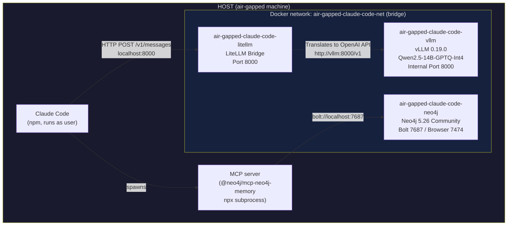

# air-gapped-claude-code

Run [Claude Code](https://docs.anthropic.com/en/docs/claude-code) with a locally hosted LLM on a machine that has no internet access. Model weights, inference engine, and conversation memory are all self-contained — nothing leaves the host.

## Problem statement

Financial institutions, defence contractors, and healthcare providers routinely operate developer workstations in network-isolated environments: no outbound internet, strict data-residency requirements, and continuous monitoring for exfiltration. Commercial AI coding assistants send every prompt and code snippet to a remote API, which is incompatible with these controls. This project packages a production-grade OpenAI-compatible inference server (vLLM + Qwen2.5-14B), a translation bridge (LiteLLM), and a persistent graph memory store (Neo4j) into a Docker Compose stack that binds exclusively to `127.0.0.1`, satisfies a two-person rule for model provenance (weights are baked in at build time on a controlled connected machine), and requires zero network access at runtime. Claude Code connects to the local LiteLLM endpoint, which translates Anthropic-style requests into vLLM-compatible commands.

---

## Architecture



| Binding | Protocol | Consumer |
|---|---|---|
| `127.0.0.1:8000` | HTTP (Anthropic-compatible) | Claude Code |
| `127.0.0.1:7687` | Bolt | MCP Neo4j memory server |
| `127.0.0.1:7474` | HTTP | Neo4j Browser (UI, optional) |

All three ports are bound to `127.0.0.1`, not `0.0.0.0`. No port is reachable from the network.

---

## Prerequisites

### Connected (build) machine

| Requirement | Version | Notes |
|---|---|---|
| Docker Engine | ≥ 24.0 | Needs BuildKit and `--secret` flag support |
| Docker Compose plugin | ≥ 2.20 | `docker compose` (v2 syntax) |
| npm | any recent | Only for packing the Claude Code tarball |
| NVIDIA driver | ≥ 525 | Must match or exceed the target machine's driver |
| Disk space | ≥ 65 GB free | ~30 GB build + ~35 GB compressed tarballs |

### Air-gapped (target) machine

| Requirement | Version | Notes |
|---|---|---|
| NVIDIA driver | ≥ 525 | Install **before** the container toolkit; no internet needed for driver itself |
| NVIDIA Container Toolkit | any | Installed from bundled `.deb` files (see [Install on air-gapped machine](#2-install-on-the-air-gapped-machine)) |
| Docker Engine | ≥ 24.0 | Must already be installed |
| Docker Compose plugin | ≥ 2.20 | |
| GPU VRAM | ≥ 16 GB | Qwen2.5-14B-GPTQ-Int4: ~8 GB weights + ~6 GB FP8 KV cache (65K context) |

#### Install NVIDIA Container Toolkit (connected machine — download only)

```bash
curl -fsSL https://nvidia.github.io/libnvidia-container/gpgkey \
  | sudo gpg --dearmor -o /usr/share/keyrings/nvidia-container-toolkit-keyring.gpg

curl -sL https://nvidia.github.io/libnvidia-container/stable/deb/nvidia-container-toolkit.list \
  | sed 's#deb https://#deb [signed-by=/usr/share/keyrings/nvidia-container-toolkit-keyring.gpg] https://#g' \
  | sudo tee /etc/apt/sources.list.d/nvidia-container-toolkit.list

sudo apt-get update
sudo apt-get install -y --download-only \
  nvidia-container-toolkit \
  nvidia-container-toolkit-base \
  libnvidia-container1 \
  libnvidia-container-tools

# Copy .deb files into your transfer bundle
cp /var/cache/apt/archives/nvidia-container*.deb   ./air-gapped-claude-code-bundle/packages/nvidia/
cp /var/cache/apt/archives/libnvidia-container*.deb ./air-gapped-claude-code-bundle/packages/nvidia/
```

---

## Model download

Qwen2.5-14B is hosted on Hugging Face. The model weights are downloaded once, at Docker image build time, and baked into the image layer. This project uses the **GPTQ INT4 quantized** version (`Qwen/Qwen2.5-14B-Instruct-GPTQ-Int4`): ~8 GB of weights on a 16 GB GPU, with ~6 GB remaining for FP8 KV cache — enough for a **65,536 token** context window. 128K is not achievable on 16 GB VRAM with a 14B model (weights + KV cache would exceed available memory).

**Before building**, accept the model license on Hugging Face and generate a read-only token at `https://huggingface.co/settings/tokens`.

The token is passed as a [BuildKit secret](https://docs.docker.com/build/building/secrets/) — it is mounted only during the `RUN` step that calls `snapshot_download` and is **never written to any image layer**.

---

## Quickstart

### 1. Build and export (connected machine)

```bash
# Export your HuggingFace token
export HF_TOKEN=hf_...

# Build the vLLM image (~8 GB model download)
docker build \
  --progress=plain \
  --secret id=HF_TOKEN,env=HF_TOKEN \
  -f Dockerfile.vllm \
  -t air-gapped-claude-code-vllm:latest \
  .

# Build the LiteLLM bridge image (bakes in the config)
docker build \
  -f Dockerfile.litellm \
  -t air-gapped-claude-code-litellm:latest \
  .
```

```bash
# Export the images as compressed tarballs
mkdir -p ~/air-gapped-claude-code-bundle
docker save air-gapped-claude-code-vllm:latest | gzip > ~/air-gapped-claude-code-bundle/vllm.tar.gz
docker save air-gapped-claude-code-litellm:latest | gzip > ~/air-gapped-claude-code-bundle/litellm.tar.gz
```

```bash
# Pull and export Neo4j
docker pull neo4j:5.26-community
docker save neo4j:5.26-community | gzip > ~/air-gapped-claude-code-bundle/neo4j-5.26-community.tar.gz
```

```bash
# Copy the Compose and config files into the bundle
cp docker-compose.yml ~/air-gapped-claude-code-bundle/
cp litellm-config.yaml ~/air-gapped-claude-code-bundle/
```

Transfer the entire `~/air-gapped-claude-code-bundle/` directory to the air-gapped machine.

---

### 2. Install on the air-gapped machine

```bash
# Install NVIDIA Container Toolkit from bundled .deb files
sudo dpkg -i ./air-gapped-claude-code-bundle/packages/nvidia/libnvidia-container1_*.deb
sudo dpkg -i ./air-gapped-claude-code-bundle/packages/nvidia/libnvidia-container-tools_*.deb
sudo dpkg -i ./air-gapped-claude-code-bundle/packages/nvidia/nvidia-container-toolkit-base_*.deb
sudo dpkg -i ./air-gapped-claude-code-bundle/packages/nvidia/nvidia-container-toolkit_*.deb

# Configure Docker to use the NVIDIA runtime and restart
sudo nvidia-ctk runtime configure --runtime=docker
sudo systemctl restart docker
```

```bash
# Load the Docker images
docker load < ./air-gapped-claude-code-bundle/vllm.tar.gz
docker load < ./air-gapped-claude-code-bundle/litellm.tar.gz
docker load < ./air-gapped-claude-code-bundle/neo4j-5.26-community.tar.gz
```

```bash
# Copy the Compose file to a working directory and start the stack
mkdir -p ~/air-gapped-claude-code
cp ./air-gapped-claude-code-bundle/docker-compose.yml ~/air-gapped-claude-code/
cd ~/air-gapped-claude-code
docker compose up -d
```

---

### 3. Wait for the stack to be ready

```bash
# LiteLLM gateway (port 8000)
until curl -sf http://127.0.0.1:8000/health; do printf '.'; sleep 3; done && echo ' Bridge ready'
```

---

### 4. Configure Claude Code

```bash
# Point Claude Code at the LiteLLM bridge
# IMPORTANT: Do not include /v1 here, as the Anthropic SDK appends it automatically
export ANTHROPIC_BASE_URL="http://127.0.0.1:8000"
export ANTHROPIC_AUTH_TOKEN="airgap-local"
export ANTHROPIC_API_KEY=""
```
# (Optional) persist across sessions
echo 'export ANTHROPIC_BASE_URL="http://127.0.0.1:8000"' >> ~/.bashrc
echo 'export ANTHROPIC_AUTH_TOKEN="airgap-local"' >> ~/.bashrc
echo 'export ANTHROPIC_API_KEY=""' >> ~/.bashrc
```

```bash
# Start Claude Code
claude
```

---

## Configuration

### docker-compose.yml environment variables

#### vLLM service (`air-gapped-claude-code-vllm`)

| Variable | Default | Description |
|---|---|---|
| `NVIDIA_VISIBLE_DEVICES` | `all` | Which GPUs are passed to the container. Set to a specific index (e.g. `0`) to restrict to one GPU. |
| `NVIDIA_DRIVER_CAPABILITIES` | `compute,utility` | NVIDIA capabilities forwarded into the container. `compute` is required for CUDA; `utility` enables `nvidia-smi`. |
| `VLLM_NO_USAGE_STATS` | `1` | Disables vLLM's anonymous usage telemetry. |
| `DO_NOT_TRACK` | `1` | Suppresses analytics from any library that respects this convention. |

#### Neo4j service (`air-gapped-claude-code-neo4j`)

| Variable | Default | Description |
|---|---|---|
| `NEO4J_AUTH` | `neo4j/ac4Sw1Q3Y4W834ctwpNaOq8` | `username/password` for the database. Change before deployment if the machine is shared. |
| `NEO4J_PLUGINS` | `["apoc"]` | APOC plugin is required by `@neo4j/mcp-neo4j-memory`. |
| `NEO4J_dbms_memory_heap_initial__size` | `512m` | JVM heap initial allocation. |
| `NEO4J_dbms_memory_heap_max__size` | `1G` | JVM heap maximum. Increase on machines with ≥ 32 GB RAM. |
| `NEO4J_dbms_memory_pagecache_size` | `512m` | Page cache for graph data. |

#### Compose-level

| Variable | Default | Description |
|---|---|---|
| `NEO4J_DATA` | `./neo4j-data` | Host path where Neo4j persists graph data. Override with an absolute path to control placement. |

### vLLM inference server flags (baked into `Dockerfile.vllm`)

| Flag | Value | Description |
|---|---|---|
| `--model` | `/models/qwen2.5-14b-gptq-int4` | Path to the baked-in model weights inside the image. |
| `--served-model-name` | `claude-3-5-sonnet-20241022` | Model name returned by `/v1/models`. |
| `--quantization` | `gptq` | Activates GPTQ INT4 kernel; must match the checkpoint format. |
| `--gpu-memory-utilization` | `0.90` | Fraction of GPU VRAM to allocate for model + KV cache. |
| `--max-model-len` | `65536` | Maximum context window in tokens (hardware ceiling on 16 GB). |
| `--kv-cache-dtype` | `fp8` | FP8 KV cache roughly halves KV memory vs FP16, enabling 65K context. |
| `--enforce-eager` | — | Disables CUDA graphs to save ~0.5 GB VRAM. |

---

## Claude Code integration

Claude Code communicates with the local LiteLLM bridge over the Anthropic-compatible API. Three environment variables control the connection:

```bash
# Required — redirect all API traffic to the local bridge
# IMPORTANT: Do not include /v1 as the SDK appends it automatically
export ANTHROPIC_BASE_URL="http://127.0.0.1:8000"

# Required — LiteLLM does not validate API keys; any non-empty string works
export ANTHROPIC_AUTH_TOKEN="airgap-local"

# Required — must be empty so the SDK does not attempt to use a real key
export ANTHROPIC_API_KEY=""
```

LiteLLM handles the translation between the Anthropic protocol and the OpenAI protocol used by vLLM. It also aliases multiple Claude model names (e.g., `claude-sonnet-4-6`, `claude-haiku-4-5`) to your local Qwen2.5-14B model.

### MCP graph memory (optional)

The Neo4j graph memory server gives Claude Code persistent, structured memory across sessions. Configure it by writing `~/.claude/mcp_config.json`:

```json
{
  "mcpServers": {
    "graph-memory": {
      "command": "npx",
      "args": ["-y", "@neo4j/mcp-neo4j-memory"],
      "env": {
        "NEO4J_URI": "bolt://localhost:7687",
        "NEO4J_USER": "neo4j",
        "NEO4J_PASSWORD": "ac4Sw1Q3Y4W834ctwpNaOq8",
        "NEO4J_DATABASE": "memory"
      }
    }
  }
}
```

The MCP server runs as an `npx` subprocess of Claude Code and communicates with Neo4j over Bolt on `localhost:7687`.

### CLAUDE.md — making memory use automatic

Claude Code reads `CLAUDE.md` at session start and treats its content as standing instructions. Without it, memory tools are used only when explicitly asked.

Place the file at `~/.claude/CLAUDE.md` (applies to every project) or in a project root `CLAUDE.md` (project-scoped). Exact content to copy:

```
# Memory

You have access to a persistent graph memory through the graph-memory MCP
server (tools: store_memory, search_memories, recall_memories,
get_related_memories, create_relationship, update_memory).

## Rules — follow these without being asked

1. START OF SESSION
   Call search_memories("{project name} overview") before reading any file.
   If results exist, use them as your starting context.

2. BEFORE READING ANY FILE
   Call search_memories("{file path}").
   Skip the file read if the memory already describes its purpose and contents.
   Only read the file when you need a specific line or the memory is stale.

3. AFTER ANALYSING A FILE OR MODULE
   Call store_memory with:
   - name: the file path
   - content: its purpose, key exports, dependencies, and anything non-obvious
   - category: "file"

4. AFTER DISCOVERING AN ARCHITECTURE DECISION OR CONVENTION
   Call store_memory with category "architecture".
   Include the reason behind the decision if you know it.

5. AFTER FINDING A BUG OR ISSUE
   Call store_memory with category "bug".
   Include file path, line range, and root cause.
   Call create_relationship to link it to the relevant file memory.

6. AFTER COMPLETING ANY TASK
   Call store_memory with category "task".
   Include: what was done, which files changed, and why.

## What not to store
Do not store information that is directly readable from the current code
(e.g. exact function signatures). Store interpretation, intent, and findings.
```

---

## What stays on your machine

This section documents, for compliance and CISO review, the data categories that are confined to the host.

| Data | Location | Never leaves because |
|---|---|---|
| Model weights (Qwen2.5-14B-GPTQ-Int4, ~8 GB) | Docker image layer (`/models/qwen2.5-14b-gptq-int4`) | Baked into the image at build time; no outbound pull at runtime |
| HuggingFace token | Never persisted | Passed as a BuildKit secret (`--mount=type=secret`) |
| All prompts and completions | In-process memory only | vLLM and LiteLLM run entirely locally; telemetry is disabled |
| Conversation graph (Neo4j) | `$NEO4J_DATA` on the host | Bolt port bound to `127.0.0.1:7687` only |
| API traffic | Host loopback | All ports (`8000`, `7474`, `7687`) bound to `127.0.0.1` |

**Verifying network isolation at runtime:**

```bash
# Confirm no outbound connection reaches Anthropic's API
curl -s --max-time 3 https://api.anthropic.com && echo "NETWORK REACHABLE" || echo "ISOLATED"

# Confirm ports are not listening on external interfaces
ss -tlnp | grep -E '8000|7474|7687'
# All lines should show 127.0.0.1:PORT, not 0.0.0.0:PORT
```

To enforce isolation at the OS level:

```bash
sudo rfkill block all    # disable all wireless interfaces
```

---

## Software bill of materials

| Component | Version | License |
|---|---|---|
| vLLM | 0.19.0 | Apache-2.0 |
| LiteLLM | latest | MIT |
| Qwen2.5-14B-Instruct-GPTQ-Int4 | — | Apache-2.0 |
| Neo4j Community | 5.26 | GPL-3.0 |
| NVIDIA Container Toolkit | latest stable | Apache-2.0 |
| @neo4j/mcp-neo4j-memory | latest | Apache-2.0 |
