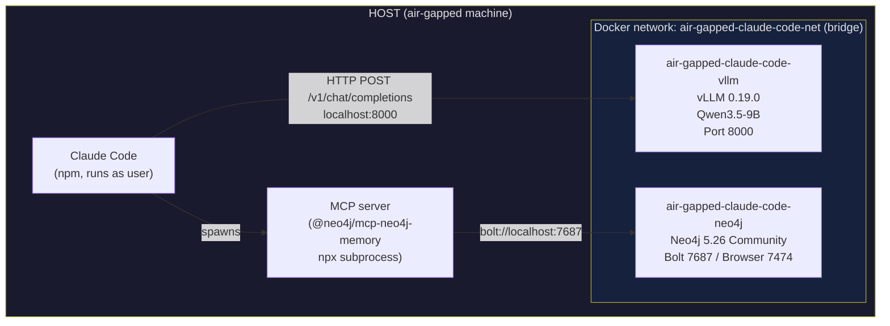

# air-gapped-claude-code

Run [Claude Code](https://docs.anthropic.com/en/docs/claude-code) with a locally hosted LLM on a machine that has no internet access. Model weights, inference engine, and conversation memory are all self-contained — nothing leaves the host.

## Problem statement

Financial institutions, defence contractors, and healthcare providers routinely operate developer workstations in network-isolated environments: no outbound internet, strict data-residency requirements, and continuous monitoring for exfiltration. Commercial AI coding assistants send every prompt and code snippet to a remote API, which is incompatible with these controls. This project packages a production-grade OpenAI-compatible inference server (vLLM + Qwen3.5-9B) and a persistent graph memory store (Neo4j) into a Docker Compose stack that binds exclusively to `127.0.0.1`, satisfies a two-person rule for model provenance (weights are baked in at build time on a controlled connected machine), and requires zero network access at runtime. Claude Code connects to the local endpoint using the same API protocol it uses against Anthropic's servers.

---

## Architecture



| Binding | Protocol | Consumer |
|---|---|---|
| `127.0.0.1:8000` | HTTP (OpenAI-compatible REST) | Claude Code, any OpenAI-compatible client |
| `127.0.0.1:7687` | Bolt | MCP Neo4j memory server |
| `127.0.0.1:7474` | HTTP | Neo4j Browser (UI, optional) |

All three ports are bound to `127.0.0.1`, not `0.0.0.0`. No port is reachable from the network.

---

## Prerequisites

### Connected (build) machine

| Requirement | Version | Notes |
|---|---|---|
| Docker Engine | ≥ 24.0 | Needs BuildKit and `--secret` flag support |
| Docker Compose plugin | ≥ 2.20 | `docker compose` (v2 syntax) |
| npm | any recent | Only for packing the Claude Code tarball |
| NVIDIA driver | ≥ 525 | Must match or exceed the target machine's driver |
| Disk space | ≥ 60 GB free | ~26 GB build + ~30 GB compressed tarball |

### Air-gapped (target) machine

| Requirement | Version | Notes |
|---|---|---|
| NVIDIA driver | ≥ 525 | Install **before** the container toolkit; no internet needed for driver itself |
| NVIDIA Container Toolkit | any | Installed from bundled `.deb` files (see [Install on air-gapped machine](#2-install-on-the-air-gapped-machine)) |
| Docker Engine | ≥ 24.0 | Must already be installed |
| Docker Compose plugin | ≥ 2.20 | |
| GPU VRAM | ≥ 20 GB | Qwen3.5-9B at float16 with `--gpu-memory-utilization 0.88` |

#### Install NVIDIA Container Toolkit (connected machine — download only)

```bash
curl -fsSL https://nvidia.github.io/libnvidia-container/gpgkey \
  | sudo gpg --dearmor -o /usr/share/keyrings/nvidia-container-toolkit-keyring.gpg

curl -sL https://nvidia.github.io/libnvidia-container/stable/deb/nvidia-container-toolkit.list \
  | sed 's#deb https://#deb [signed-by=/usr/share/keyrings/nvidia-container-toolkit-keyring.gpg] https://#g' \
  | sudo tee /etc/apt/sources.list.d/nvidia-container-toolkit.list

sudo apt-get update
sudo apt-get install -y --download-only \
  nvidia-container-toolkit \
  nvidia-container-toolkit-base \
  libnvidia-container1 \
  libnvidia-container-tools

# Copy .deb files into your transfer bundle
cp /var/cache/apt/archives/nvidia-container*.deb   ./air-gapped-claude-code-bundle/packages/nvidia/
cp /var/cache/apt/archives/libnvidia-container*.deb ./air-gapped-claude-code-bundle/packages/nvidia/
```

---

## Model download

Qwen3.5-9B is hosted on Hugging Face. The model weights are downloaded once, at Docker image build time, and baked into the image layer. They are never downloaded again at runtime.

**Before building**, accept the model license at `https://huggingface.co/Qwen/Qwen3.5-9B` and generate a read-only token at `https://huggingface.co/settings/tokens`.

The token is passed as a [BuildKit secret](https://docs.docker.com/build/building/secrets/) — it is mounted only during the `RUN` step that calls `snapshot_download` and is **never written to any image layer**.

---

## Quickstart

### 1. Build and export (connected machine)

```bash
# Export your HuggingFace token
export HF_TOKEN=hf_...

# Build the vLLM image (~26 GB download; 30–90 min depending on bandwidth)
docker build \
  --progress=plain \
  --secret id=HF_TOKEN,env=HF_TOKEN \
  -f Dockerfile.vllm \
  -t air-gapped-claude-code-vllm:latest \
  .
```

```bash
# Export the vLLM image as a compressed tarball (~30 GB)
mkdir -p ~/air-gapped-claude-code-bundle
docker save air-gapped-claude-code-vllm:latest | gzip > ~/air-gapped-claude-code-bundle/air-gapped-claude-code-vllm.tar.gz
```

```bash
# Pull and export Neo4j
docker pull neo4j:5.26-community
docker save neo4j:5.26-community | gzip > ~/air-gapped-claude-code-bundle/neo4j-5.26-community.tar.gz
```

```bash
# Copy the Compose file into the bundle
cp docker-compose.yml ~/air-gapped-claude-code-bundle/
```

Transfer the entire `~/air-gapped-claude-code-bundle/` directory to the air-gapped machine (USB drive, encrypted transfer, etc.).

---

### 2. Install on the air-gapped machine

```bash
# Install NVIDIA Container Toolkit from bundled .deb files
sudo dpkg -i ./air-gapped-claude-code-bundle/packages/nvidia/libnvidia-container1_*.deb
sudo dpkg -i ./air-gapped-claude-code-bundle/packages/nvidia/libnvidia-container-tools_*.deb
sudo dpkg -i ./air-gapped-claude-code-bundle/packages/nvidia/nvidia-container-toolkit-base_*.deb
sudo dpkg -i ./air-gapped-claude-code-bundle/packages/nvidia/nvidia-container-toolkit_*.deb

# Configure Docker to use the NVIDIA runtime and restart
sudo nvidia-ctk runtime configure --runtime=docker
sudo systemctl restart docker
```

```bash
# Load the Docker images (air-gapped-claude-code-vllm is ~30 GB; takes a few minutes)
docker load < ./air-gapped-claude-code-bundle/air-gapped-claude-code-vllm.tar.gz
docker load < ./air-gapped-claude-code-bundle/neo4j-5.26-community.tar.gz
```

```bash
# Copy the Compose file to a working directory and start the stack
mkdir -p ~/air-gapped-claude-code
cp ./air-gapped-claude-code-bundle/docker-compose.yml ~/air-gapped-claude-code/
cd ~/air-gapped-claude-code
docker compose up -d
```

---

### 3. Wait for the stack to be ready

```bash
# vLLM loads the model from disk; allow 60–120 s after container start
until curl -sf http://127.0.0.1:8000/health; do printf '.'; sleep 3; done && echo ' vLLM ready'

# Neo4j
until docker exec air-gapped-claude-code-neo4j cypher-shell -u neo4j -p ac4Sw1Q3Y4W834ctwpNaOq8 "RETURN 1" \
      > /dev/null 2>&1; do printf '.'; sleep 3; done && echo ' Neo4j ready'
```

---

### 4. Configure Claude Code

```bash
# Point Claude Code at the local vLLM endpoint
export ANTHROPIC_BASE_URL="http://127.0.0.1:8000/v1"
export ANTHROPIC_AUTH_TOKEN="airgap-local"
export ANTHROPIC_API_KEY=""

# (Optional) persist across sessions
echo 'export ANTHROPIC_BASE_URL="http://127.0.0.1:8000/v1"' >> ~/.bashrc
echo 'export ANTHROPIC_AUTH_TOKEN="airgap-local"' >> ~/.bashrc
echo 'export ANTHROPIC_API_KEY=""' >> ~/.bashrc
```

```bash
# Start Claude Code
claude
```

---

## Configuration

### docker-compose.yml environment variables

#### vLLM service (`air-gapped-claude-code-vllm`)

| Variable | Default | Description |
|---|---|---|
| `NVIDIA_VISIBLE_DEVICES` | `all` | Which GPUs are passed to the container. Set to a specific index (e.g. `0`) to restrict to one GPU. |
| `NVIDIA_DRIVER_CAPABILITIES` | `compute,utility` | NVIDIA capabilities forwarded into the container. `compute` is required for CUDA; `utility` enables `nvidia-smi`. |
| `VLLM_NO_USAGE_STATS` | `1` | Disables vLLM's anonymous usage telemetry. |
| `DO_NOT_TRACK` | `1` | Suppresses analytics from any library that respects this convention. |

#### Neo4j service (`air-gapped-claude-code-neo4j`)

| Variable | Default | Description |
|---|---|---|
| `NEO4J_AUTH` | `neo4j/ac4Sw1Q3Y4W834ctwpNaOq8` | `username/password` for the database. Change before deployment if the machine is shared. |
| `NEO4J_PLUGINS` | `["apoc"]` | APOC plugin is required by `@neo4j/mcp-neo4j-memory`. |
| `NEO4J_dbms_memory_heap_initial__size` | `512m` | JVM heap initial allocation. |
| `NEO4J_dbms_memory_heap_max__size` | `1G` | JVM heap maximum. Increase on machines with ≥ 32 GB RAM. |
| `NEO4J_dbms_memory_pagecache_size` | `512m` | Page cache for graph data. |

#### Compose-level

| Variable | Default | Description |
|---|---|---|
| `NEO4J_DATA` | `./neo4j-data` | Host path where Neo4j persists graph data. Override with an absolute path to control placement. |

### vLLM inference server flags (baked into `Dockerfile.vllm`)

| Flag | Value | Description |
|---|---|---|
| `--model` | `/models/qwen3.5-9b` | Path to the baked-in model weights inside the image. |
| `--served-model-name` | `claude-3-5-sonnet-20241022` | Model name returned by `/v1/models`. Set to this value so Claude Code accepts it without extra configuration. |
| `--dtype` | `float16` | Weight precision. Halves VRAM compared to float32. |
| `--gpu-memory-utilization` | `0.88` | Fraction of GPU VRAM to allocate for the KV cache. |
| `--max-model-len` | `32768` | Maximum context window in tokens. |
| `--max-num-seqs` | `4` | Maximum concurrent sequences (request parallelism). |
| `--enable-auto-tool-choice` | — | Enables OpenAI-compatible tool/function calling. |
| `--tool-call-parser` | `hermes` | Parser for Qwen's Hermes-style tool call format. |

---

## Claude Code integration

Claude Code communicates with the local vLLM instance over the OpenAI-compatible API. Three environment variables control the connection:

```bash
# Required — redirect all API traffic to the local server
export ANTHROPIC_BASE_URL="http://127.0.0.1:8000/v1"

# Required — vLLM does not validate API keys; any non-empty string works
export ANTHROPIC_AUTH_TOKEN="airgap-local"

# Required — must be empty so the SDK does not attempt to use a real key
export ANTHROPIC_API_KEY=""
```

vLLM serves the model under the name `claude-3-5-sonnet-20241022` (configured via `--served-model-name`). Claude Code validates the model name against this string, so no additional model override is needed.

### MCP graph memory (optional)

The Neo4j graph memory server gives Claude Code persistent, structured memory across sessions. Configure it by writing `~/.claude/mcp_config.json`:

```json
{
  "mcpServers": {
    "graph-memory": {
      "command": "npx",
      "args": ["-y", "@neo4j/mcp-neo4j-memory"],
      "env": {
        "NEO4J_URI": "bolt://localhost:7687",
        "NEO4J_USER": "neo4j",
        "NEO4J_PASSWORD": "ac4Sw1Q3Y4W834ctwpNaOq8",
        "NEO4J_DATABASE": "memory"
      }
    }
  }
}
```

The MCP server runs as an `npx` subprocess of Claude Code and communicates with Neo4j over Bolt on `localhost:7687`.

---

## What stays on your machine

This section documents, for compliance and CISO review, the data categories that are confined to the host.

| Data | Location | Never leaves because |
|---|---|---|
| Model weights (Qwen3.5-9B, ~18 GB) | Docker image layer (`/models/qwen3.5-9b`) | Baked into the image at build time; no volume mount; no outbound pull at runtime |
| HuggingFace token | Never persisted | Passed as a BuildKit secret (`--mount=type=secret`); not written to any image layer or build cache |
| All prompts and completions | In-process memory only | vLLM runs entirely locally; `VLLM_NO_USAGE_STATS=1` disables the only optional outbound call |
| Conversation graph (Neo4j) | `$NEO4J_DATA` on the host (default: `./neo4j-data`) | Bolt port bound to `127.0.0.1:7687` only |
| API traffic | Host loopback | All three ports (`8000`, `7474`, `7687`) are bound to `127.0.0.1`, not `0.0.0.0` |

**Verifying network isolation at runtime:**

```bash
# Confirm no outbound connection reaches Anthropic's API
curl -s --max-time 3 https://api.anthropic.com && echo "NETWORK REACHABLE" || echo "ISOLATED"

# Confirm ports are not listening on external interfaces
ss -tlnp | grep -E '8000|7474|7687'
# All lines should show 127.0.0.1:PORT, not 0.0.0.0:PORT
```

To enforce isolation at the OS level:

```bash
sudo rfkill block all    # disable all wireless interfaces
```

---

## Software bill of materials

| Component | Version | License |
|---|---|---|
| Base image | `python:3.12-slim` (Debian Bookworm) | Python PSF / Debian |
| PyTorch | 2.10.0+cu130 | BSD-3-Clause |
| CUDA runtime (bundled in torch wheel) | 13.0 | NVIDIA CUDA EULA |
| vLLM | 0.19.0 | Apache-2.0 |
| huggingface_hub | ≥ 0.24 | Apache-2.0 |
| Qwen3.5-9B | — | MIT |
| Neo4j Community | 5.26 | GPL-3.0 |
| NVIDIA Container Toolkit | latest stable | Apache-2.0 |
| @neo4j/mcp-neo4j-memory | latest | Apache-2.0 |
